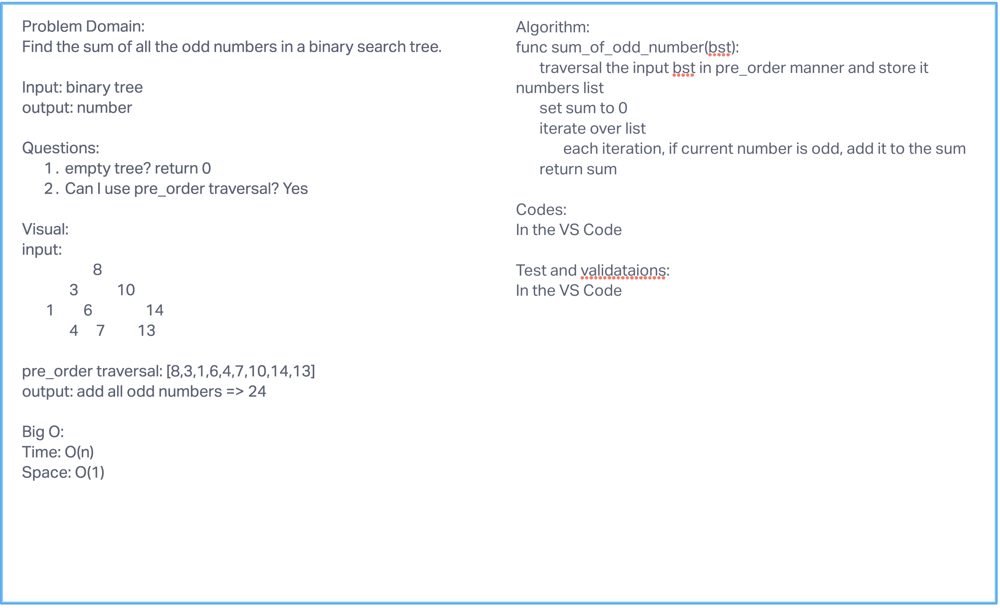

# Lab: 36 - Computational Thinking

# Find common values in 2 binary trees - 03/17/2022

Write a function called `tree_intersection` that takes two binary trees as parameters. Using your Hashmap implementation as a port of your algorighm, return a set of values found in both trees.

## Challenges

No challenges

## Unit test

Run command `pytest tests/test_tree_intersection.py` to run the unit test.

# Find first repeated word - 03/14/2022

- Write a function called repeated_word that finds the first word to occur more than once in a string
- Arguments: string
- Return: string or return the breakdown of the input string in dictionary format when there is no repeating word.

## Challenges

No challenges

## Unit test

Run command `pytest tests/test_repeated_word.py` to run the pytest

# Find sum of odd numbers in a binary search tree - 02/10/2022

## Challenges

No Challenges

## Whiteboard process

## Unit tests

Run command `pytest tests/test_sum_of_odd.py` to run unit tests
