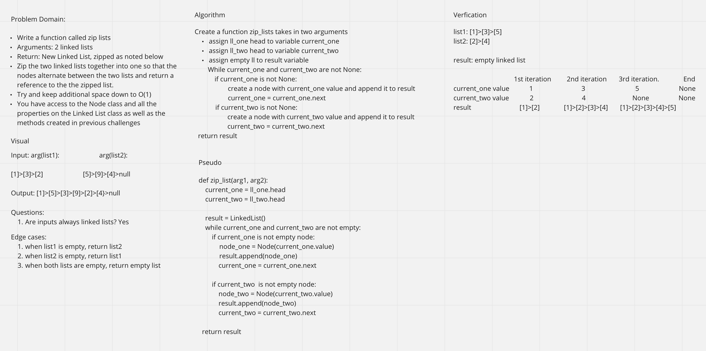
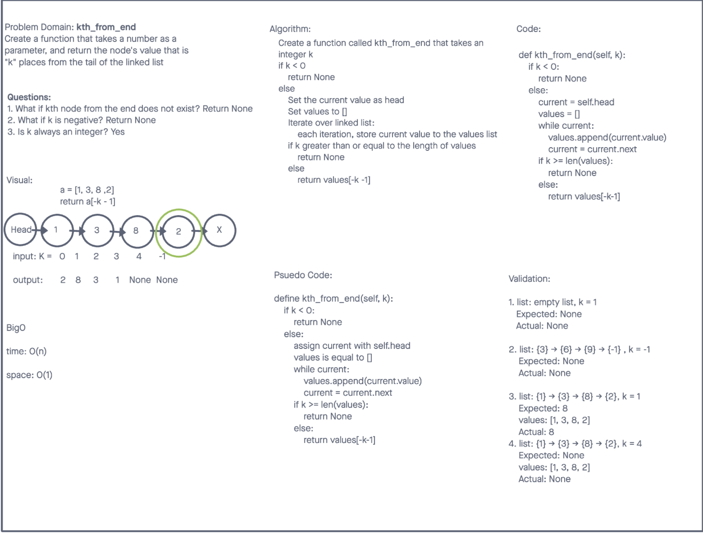

# Zip two linked lists - 01/03/2022

Write a function called zip lists that takes two linked lists as inputs and return a new linked list that zip second linked list to first linked list

## Whiteboard Process

## API

- `zip_lists` function
  - Arguments: 2 linked lists
  - Return: New Linked List
  - Description: Zip the two linked lists together into one so that the nodes alternate between the two lists and return a reference to the the zipped list.
  - Have access to the Node class and all the properties on the Linked List class as well as the methods created in previous challenges.

# Linked List - kth from end - 12/27/2021

Return k-th value from the end of a linked list.

## Whiteboard Process

## API

- `kth_from_end` method:
  - argument: integer k
  - return kth node value from the end of the linked list
    - if k is negative, return `None`
    - if kth node from the end doesn't exist, return `None`
    - if linked list is empty, return `None`

# Linked List Insertions - 12/20/2021

**Author**: Wenhao Piao  
**Pair programming partner**: Arthur

## Whiteboard Process

## API

- `append` method:
  - arguments: new value
  - adds a new node with the given value to the end of the list
- `insert_before` method:
  - arguments: value, new value
  - adds a new node with the given new value immediately before the first node that has the value specified
- `insert_after` method:
  - arguments: value, new value
  - adds a new node with the given new value immediately after the first node that has the value specified

# Singly Linked List - 12/18/2021

Implement singly linked lists and its insert, includes, and to_strint method

## Challenge

No major challenges. The concept and implementaion are same as in other programming languages.

## Approach & Efficiency

- `insert` method:
  - create a node with passed argument. make this node head and make its next point to previous head
  - Time: O(1)
- `includes` method:
  - traverse the linked list from head to last node and check if the current node's value is eqaul to passed argument. If it finds match return `True`, if not return `False`
  - Time: O(n)
- `to_string` method:
  - traverse the linked list from head to last node, gather all nodes value and print it out in a required format.
  - Time: O(n)

## API

- `insert` method:  
  It takes a value and insert a new node with that value to the `head` of the linked list
- `includes` method:  
  It takes a value and and check if the value exists as a Node's value somewhere within the linked list. If it finds the value, return `True`. Otherwise, return `False`.
- `to_string` method:  
  It returns a string representing all the values in the linked list, formatted as: `"{ a } -> { b } -> { c } -> NULL"`
