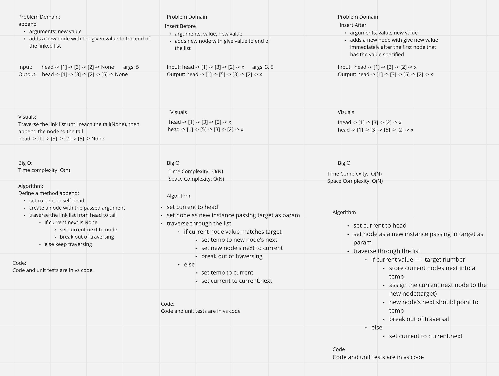

# Linked List Insertions - 12/20/2021

**Author**: Wenhao Piao  
**Pair programming partner**: Arthur

## Whiteboard Process

## API

- `append` method:
  - arguments: new value
  - adds a new node with the given value to the end of the list
- `insert_before` method:
  - arguments: value, new value
  - adds a new node with the given new value immediately before the first node that has the value specified
- `insert_after` method:
  - arguments: value, new value
  - adds a new node with the given new value immediately after the first node that has the value specified

# Singly Linked List - 12/18/2021

Implement singly linked lists and its insert, includes, and to_strint method

## Challenge

No major challenges. The concept and implementaion are same as in other programming languages.

## Approach & Efficiency

- `insert` method:
  - create a node with passed argument. make this node head and make its next point to previous head
  - Time: O(1)
- `includes` method:
  - traverse the linked list from head to last node and check if the current node's value is eqaul to passed argument. If it finds match return `True`, if not return `False`
  - Time: O(n)
- `to_string` method:
  - traverse the linked list from head to last node, gather all nodes value and print it out in a required format.
  - Time: O(n)

## API

- `insert` method:  
  It takes a value and insert a new node with that value to the `head` of the linked list
- `includes` method:  
  It takes a value and and check if the value exists as a Node's value somewhere within the linked list. If it finds the value, return `True`. Otherwise, return `False`.
- `to_string` method:  
  It returns a string representing all the values in the linked list, formatted as: `"{ a } -> { b } -> { c } -> NULL"`
