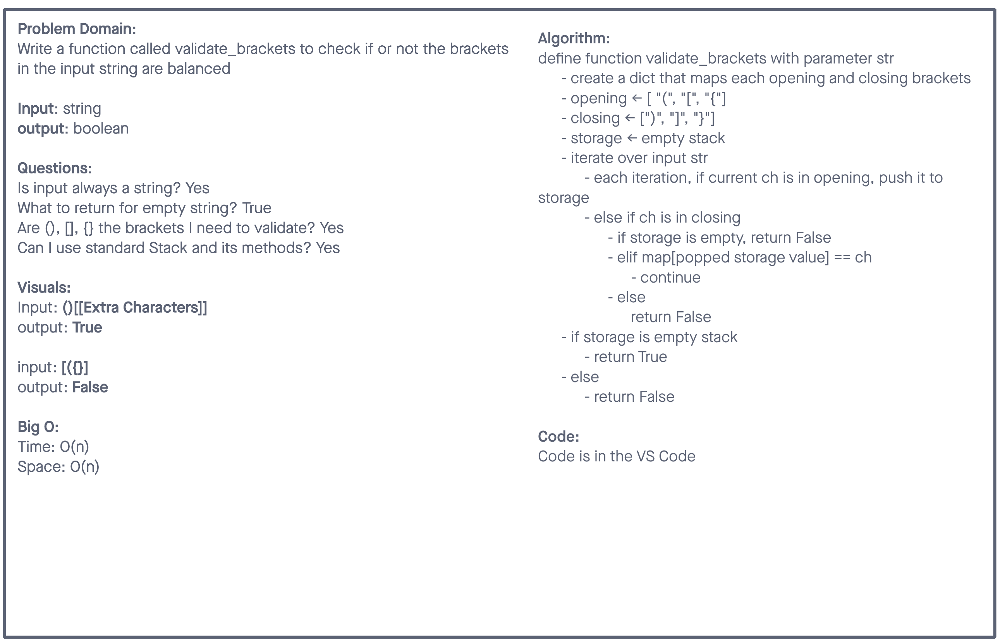
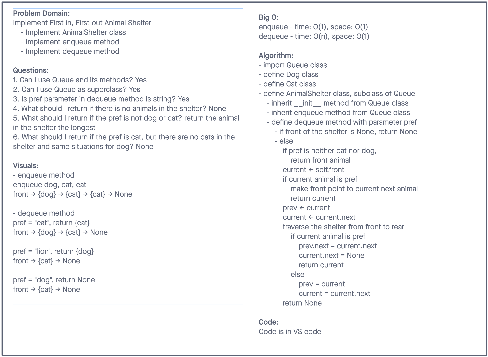

# Validate Brackets - 01/24/2022

Write a function called validate brackets that check if or not the brackets in the input string are balanced

## Challenges

No challenges

## Whiteboard process

## Unit Test

Run command `pytest` to run the unit test

# First-in, First-out Animal Shelter - 01/20/2022

Implement First-in, First-out Animal Shelter

## Challenges

No challenges

## Whiteboard process

# Implement Queue with two Stacks - 01/17/2022

Using two Stacks to implement Queue

## Challenges

No challenges

## Queue methods API

- Queue methods:

  - enqueue

    - arguments: value

  - dequeue

    - Arguments: none
    - Returns: the value from node from the front of the queue
    - Removes the node from the front of the queue
    - Should raise exception when called on empty queue

  - peek

    - Arguments: none
    - Returns: Value of the node located at the front of the queue
    - Should raise exception when called on empty stack

  - is_empty
    - Arguments: none
    - Returns: Boolean indicating whether or not the queue is empty

# Stack and Queue - 01/11/2022

Using a Linked List as the underlying data storage mechanism, implement both a Stack and a Queue

## Challenges

No challenges

## Stack methods API

- Stack instance variable: top
- Stack methods:

  - push

    - Arguments: value
    - adds a new node with that value to the top of the stack with an O(1) Time performance

  - pop

    - Arguments: none
    - Returns: the value from node from the top of the stack
    - Removes the node from the top of the stack
    - Should raise exception when called on empty stack

  - peek

    - Arguments: none
    - Returns: Value of the node located at the top of the stack
    - Should raise exception when called on empty stack

  - is_empty
    - Arguments: none
    - Returns: Boolean indicating whether or not the stack is empty

## Queue methods API

- Queue instance variable: front, rear
- Queue methods:

  - enqueue

    - arguments: value
    - adds a new node with that value to the back of the queue with an O(1) Time performance

  - dequeue

    - Arguments: none
    - Returns: the value from node from the front of the queue
    - Removes the node from the front of the queue
    - Should raise exception when called on empty queue

  - peek

    - Arguments: none
    - Returns: Value of the node located at the front of the queue
    - Should raise exception when called on empty stack

  - is_empty
    - Arguments: none
    - Returns: Boolean indicating whether or not the queue is empty
